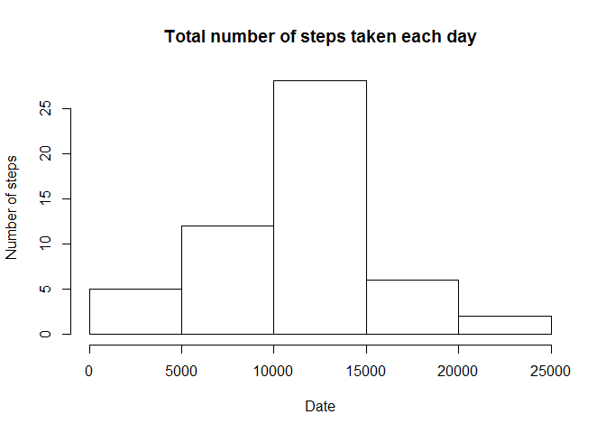
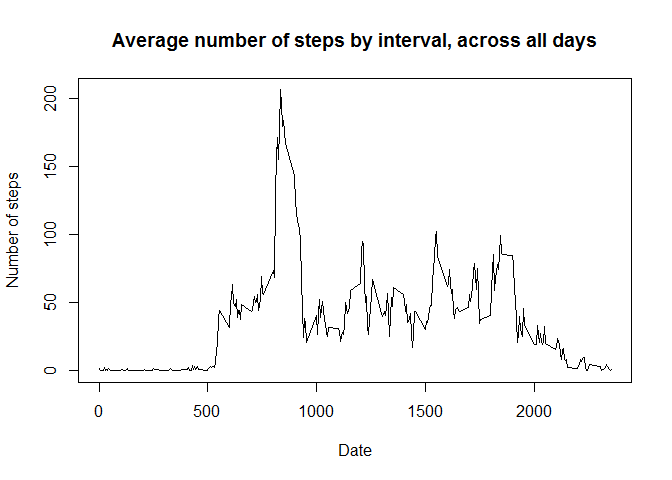
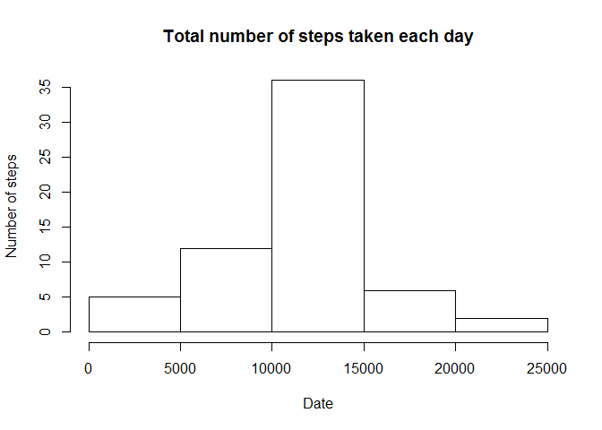

# Reproducible Research: Peer Assessment 1
knitr::opts_chunk$set(echo = TRUE, results = "hold")

## Loading and preprocessing the data

```r
# unzip data file
data_file <- "activity.csv"
if(!file.exists(data_file)){
  unzip("activity.zip")
}

# load data set
data <- read.csv(data_file)
data$date <- as.Date(data$date, "%Y-%m-%d")
```


## What is mean total number of steps taken per day?

```r
# Calculate the total number of steps taken per day
aggregate_by_date <- aggregate(steps ~ date, data, sum)

# Histogram of the total number of steps taken each day
#barplot(aggregate_by_date$steps, names.arg = aggregate_by_date$date,
#        xlab = "Date", ylab = "Total number of steps", 
#        main = "Total number of steps taken each day")

hist(aggregate_by_date$steps, xlab = "Date", ylab = "Number of steps", 
        main = "Total number of steps taken each day")
```



### Calculate and report the mean and median of the total number of steps taken per day

```r
steps_mean <- mean(aggregate_by_date$steps)
steps_median <- median(aggregate_by_date$steps)
```

```r
steps_mean
```

```
## [1] 10766.19
```

```r
steps_median
```

```
## [1] 10765
```


## What is the average daily activity pattern?

```r
# time series plot
aggregate_by_interval <- aggregate(steps ~ interval, data, mean)
plot(aggregate_by_interval$interval, aggregate_by_interval$steps, type = "l",
     xlab = "Date", ylab = "Number of steps", 
        main = "Average number of steps by interval, across all days")
```



### Which 5-minute interval, on average across all the days in the dataset, contains the maximum number of steps?

```r
max_interval <- aggregate_by_interval[which.max(aggregate_by_interval$steps), ]
```

```r
max_interval
```

```
##     interval    steps
## 104      835 206.1698
```


## Imputing missing values

```r
# total number of missing values
sum(is.na(data$steps))
```

```
## [1] 2304
```

```r
# imputing missing steps by the mean of 5-minute interval
imputing <- function(x){
  if(is.na(x[1])){
    rowIndex <- match(as.numeric(x[3]), aggregate_by_interval$interval)
    x[1] <- aggregate_by_interval[rowIndex, ][2]
  }
  x[[1]]
}

# new data set with the missing data filled in
newData <- data
newData$steps <- as.numeric(apply(newData, 1, imputing))
```


```r
# recheck missing steps
sum(is.na(newData$steps))
```

```
## [1] 0
```


```r
aggregate_by_date <- aggregate(steps ~ date, newData, sum)
hist(aggregate_by_date$steps, xlab = "Date", ylab = "Number of steps", 
        main = "Total number of steps taken each day")
```



### Calculate and report the mean and median of the total number of steps(imputed) taken per day

```r
steps_imputed_mean <- mean(aggregate_by_date$steps)
steps_imputed_median <- median(aggregate_by_date$steps)
```

```r
steps_imputed_mean
```

```
## [1] 10766.19
```

```r
steps_imputed_median
```

```
## [1] 10766.19
```

* The mean value did not change, because we use "the mean of 5-minute interval" to imput the missing steps.
* The median and mean are equal now.

## Are there differences in activity patterns between weekdays and weekends?

```r
# factor with two levels: "weekday" and "weekend"
newData$weekdays <- weekdays(newData$date)
newData$weekdays <- factor(newData$weekdays %in% c("Saturday", "Sunday"), 
                           levels = c(FALSE, TRUE), labels = c("weekday", "weekend"))
levels(newData$weekdays)
```

```
## [1] "weekday" "weekend"
```

```r
aggregate_by_interval <- aggregate(steps ~ interval + weekdays, newData, mean)

# try ggplot2
#library(ggplot2)
#ggplot(aggregate_by_interval, aes(interval, steps, color = weekdays)) + 
#  geom_line() + facet_wrap(~weekdays, ncol = 1, nrow = 2)

# time series plot
library(lattice)
xyplot(steps~interval|weekdays, aggregate_by_interval, type = "l",
       xlab = "Interval", ylab = "Number of steps",
       layout=c(1,2))
```


